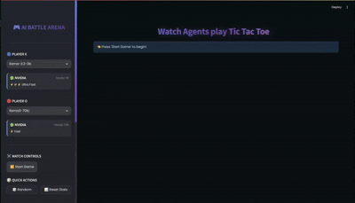

# 🎮 Multi-Agent LLM Tic Tac Toe

An interactive AI battle arena where language models compete in classic Tic Tac Toe. Built with **Streamlit** and powered by the **[Agno framework](https://docs.agno.com/)**, this application showcases autonomous AI gameplay using **NVIDIA** and **Groq** services with a professional, modern glass-morphism UI.

## 🎬 Demo



## ✨ Features

- 🤖 **13 AI Models** - Choose from NVIDIA (8 models) and Groq (5 models) providers
- ⚔️ **AI vs AI Battles** - Watch autonomous agents compete in real-time
- 📊 **Live Statistics** - Track wins, losses, draws, and winning streaks
- 🏆 **Performance Leaderboard** - See which models perform best
- 🎨 **Modern Glass-Morphism UI** - Sleek design with smooth animations
- 📜 **Move History** - Visual playback with mini boards for each move
- 🎲 **Quick Actions** - Random match generator and stats reset
- 💡 **Pro Tips** - Learn about different model characteristics
- 🔥 **Streak Tracking** - Monitor consecutive wins with live updates

## 🛠️ Tech Stack

- **[Agno Framework](https://docs.agno.com/)** - Multi-model LLM agent orchestration
- **[NVIDIA NIM](https://build.nvidia.com/)** - NVIDIA's AI model inference service
- **[Groq](https://groq.com/)** - Ultra-fast LLM inference
- **[Streamlit](https://streamlit.io/)** - Interactive web application framework
- **Python 3.8+** - Core programming language

## 📋 Prerequisites

- Python 3.8 or higher
- API keys for the providers you want to use:
  - **NVIDIA API Key** (for NVIDIA models) - [Get it here](https://build.nvidia.com/)
  - **Groq API Key** (for Groq models) - [Get it here](https://console.groq.com/keys)

## 🚀 Installation

1. **Clone the repository**
   ```bash
   git clone https://github.com/yourusername/multi-agent-llm-tictactoe.git
   cd multi-agent-llm-tictactoe
   ```

2. **Create a virtual environment**
   ```bash
   python -m venv venv
   source venv/bin/activate  # On Windows: venv\Scripts\activate
   ```

3. **Install dependencies**
   ```bash
   pip install -r requirements.txt
   ```

## 🔑 API Keys Setup

Before running the application, you need to set up your API keys:

1. **Create a `.env` file** in the project root directory

2. **Add your API keys** to the `.env` file:
   ```env
   # NVIDIA API Key (for NVIDIA NIM models)
   NVIDIA_API_KEY=your_nvidia_api_key_here

   # Groq API Key (for Groq models)
   GROQ_API_KEY=your_groq_api_key_here
   ```

### Getting Your API Keys

- **NVIDIA API Key**:
  1. Visit [https://build.nvidia.com/](https://build.nvidia.com/)
  2. Sign up or log in
  3. Generate your API key from the dashboard

- **Groq API Key**:
  1. Visit [https://console.groq.com/keys](https://console.groq.com/keys)
  2. Sign up or log in
  3. Create a new API key

**Note**: You only need the API keys for the providers you want to use. For example, if you only want to use Groq models, you only need `GROQ_API_KEY`.

## ▶️ How to Run

Start the application with:

```bash
streamlit run main.py
```

The application will automatically open in your default web browser at `http://localhost:8501`

## 🎮 How to Play

1. **Select Models** - Choose AI models for Player X (🔵) and Player O (🔴) from the sidebar
2. **Review Model Info** - Check provider badges, model size, and speed ratings
3. **Start Game** - Click the "▶️ Start Game" button
4. **Watch the Battle** - Agents will automatically play against each other
5. **Track Statistics** - Monitor wins, draws, and winning streaks in real-time
6. **View History** - See all moves with visual mini boards
7. **Quick Actions**:
   - 🎲 **Random Match** - Automatically select random models
   - 📊 **Reset Stats** - Clear session statistics
   - 🔄 **New Game** - Start a fresh match
   - ⏸️ **Pause/Resume** - Control game flow

## 🤖 Available Models

### NVIDIA NIM Models (8 models)

| Model | Size | Speed | Description |
|-------|------|-------|-------------|
| **kimi-k2** | Large | ⚡ Fast | Moonshot AI's instruction model |
| **gpt-oss-20b** | 20B | ⚡ Fast | OpenAI's open-source model |
| **mistral-nemotron** | Large | ⚡⚡ Very Fast | Mistral AI's Nemotron |
| **nemotron-nano-vl** | 8B | ⚡⚡ Very Fast | NVIDIA's vision-language model |
| **llama3-70b** | 70B | ⚡ Fast | Meta's Llama 3 70B |
| **llama-3.1-8b** | 8B | ⚡⚡ Very Fast | Meta's Llama 3.1 8B (default for O) |
| **llama-3.3-70b** | 70B | ⚡ Fast | Meta's Llama 3.3 70B (default for X) |
| **llama-3.2-3b** | 3B | ⚡⚡⚡ Ultra Fast | Meta's Llama 3.2 3B |


## 🔧 Extending with Other Models

This project uses the **[Agno framework](https://docs.agno.com/)** for multi-model support. You can easily extend it to use other LLM providers:

### Supported Providers via Agno

- **OpenAI** (GPT-4, GPT-3.5, etc.)
- **Anthropic** (Claude models)
- **HuggingFace** (Any HF model)
- **Google** (Gemini, PaLM)
- **Cohere**
- **Together AI**
- And many more...

### How to Add New Models

1. **Check Agno's model documentation**: [https://docs.agno.com/examples/models/](https://docs.agno.com/examples/models/)

2. **Install the required provider** (if not already installed):
   ```bash
   pip install openai  # for OpenAI models
   pip install anthropic  # for Claude models
   ```

3. **Update `src/config/settings.py`**:
   ```python
   MODEL_OPTIONS: Dict[str, str] = {
       # ... existing models ...
       "gpt-4": "openai:gpt-4",
       "claude-3": "anthropic:claude-3-opus-20240229",
       "mistral-7b": "huggingface:mistralai/Mistral-7B-Instruct-v0.2",
   }

   REQUIRED_KEYS_INFO: Dict[str, str] = {
       # ... existing keys ...
       "gpt-4": "OPENAI_API_KEY",
       "claude-3": "ANTHROPIC_API_KEY",
       "mistral-7b": "HUGGINGFACE_API_KEY",
   }
   ```

4. **Update `src/agents/tic_tac_toe_agent.py`**:
   ```python
   from agno.models.openai import OpenAI
   from agno.models.anthropic import Anthropic
   from agno.models.huggingface import HuggingFace

   def get_model_for_provider(provider: str, model_name: str):
       if provider == "nvidia":
           return Nvidia(id=model_name)
       elif provider == "groq":
           return Groq(id=model_name)
       elif provider == "openai":
           return OpenAI(id=model_name)
       elif provider == "anthropic":
           return Anthropic(id=model_name)
       elif provider == "huggingface":
           return HuggingFace(id=model_name)
   ```

5. **Add API keys to `.env`**:
   ```env
   OPENAI_API_KEY=your_openai_key
   ANTHROPIC_API_KEY=your_anthropic_key
   HUGGINGFACE_API_KEY=your_huggingface_key
   ```

## 📁 Project Structure

```
multi-agent-llm-tictactoe/
├── src/
│   ├── __init__.py
│   ├── agents/              # Agent implementation
│   │   ├── __init__.py
│   │   └── tic_tac_toe_agent.py
│   ├── config/              # Configuration management
│   │   ├── __init__.py
│   │   └── settings.py
│   ├── game/                # Game logic
│   │   ├── __init__.py
│   │   └── board.py
│   ├── ui/                  # User interface components
│   │   ├── __init__.py
│   │   ├── components.py
│   │   └── styles.py
│   └── utils/               # Utilities
│       ├── __init__.py
│       └── logger.py
├── UI_images/               # Demo images and gifs
│   └── ui.gif
├── main.py                  # Application entry point
├── requirements.txt         # Python dependencies
├── .env                     # Environment variables (API keys)
├── .gitignore
└── README.md                
```

### Code Architecture

- **`src/config/settings.py`** - Centralized configuration, model definitions, API key validation
- **`src/game/board.py`** - TicTacToeBoard class with game logic, move validation, winner detection
- **`src/agents/tic_tac_toe_agent.py`** - Agent factory, model provider management
- **`src/ui/components.py`** - Reusable UI components (board, history, banners)
- **`src/ui/styles.py`** - CSS styling and animations
- **`src/utils/logger.py`** - Structured logging configuration
- **`main.py`** - Main game controller, session state, event handling

## 🔧 Configuration

Edit `src/config/settings.py` to customize:

- **Default models** for Player X and O
- **Model configurations** and metadata
- **Game constants** (board size, players)
- **Debug mode** for detailed logging
- **UI settings** (title, icon, layout)

## 🐛 Debugging

Enable debug mode in `src/config/settings.py`:

```python
DEBUG_MODE = True
```

This will show detailed logs in the console including:
- Agent moves and reasoning
- API calls and responses
- Game state changes
- Performance metrics

## 📦 Dependencies

Core dependencies:
- **streamlit** - Web UI framework
- **agno** - Multi-model agent framework
- **nest-asyncio** - Async support for agents
- **python-dotenv** - Environment variable management

See `requirements.txt` for the complete list.

## 🤝 Contributing

Contributions are welcome! Please follow these guidelines:

1. Follow the existing code structure and architecture
2. Add type hints to all functions and classes
3. Update documentation for new features
4. Test thoroughly before committing
5. Ensure all models work correctly with the Agno framework

## 📄 License

This project is provided as-is for educational and demonstration purposes.

## 🙏 Acknowledgments

- Built with ❤️ using [Streamlit](https://streamlit.io/)
- Powered by [Agno Framework](https://docs.agno.com/) for multi-model agent orchestration
- Uses [NVIDIA](https://build.nvidia.com/) and [Groq](https://groq.com/) AI services
- Inspired by the classic game of Tic Tac Toe

---

## 📞 Support

If you encounter any issues or have questions:
- Check the [Agno Documentation](https://docs.agno.com/)
- Review [NVIDIA Docs](https://docs.nvidia.com/nim/)
- Visit [Groq Documentation](https://console.groq.com/docs)

---

**Enjoy watching AI agents battle it out!** 🤖⚔️🤖
